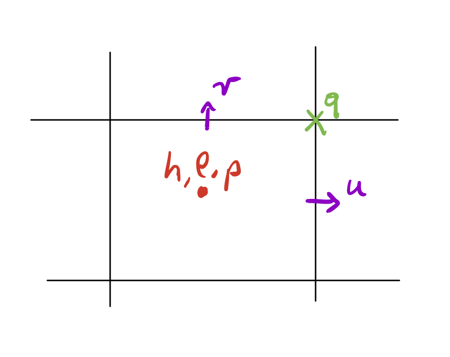

---
author:
- Andy Hogg
date: |
  Australian Ocean Modelling "Summer" School\
  April 2019
title: Some Notes on Ocean Modelling
---

------------------------------------------------------------------------

# Introductory Lecture

- Note differing backgrounds and approaches. Steve comes from physics to
  global ocean models. Andy has a fluid mechanics to idealised models
  background. We hope these differences will complement, not impede
  understanding ...

- There is much to learn about ocean models -- between us we know a lot,
  but in many topics there may be people who are more expert than us --
  please feel free to contribute, or ask questions to clarify.

- Our approach is to outline fundamental topics, which will allow you to
  apply what you have learnt to your particular configuration.

- Notation. We will mostly use vector notation, and will try to be
  consistent. But, on occasion, we need to use tensors. Going from
  vector to tensor notation for position, $\mathbf{x}$ and velocity,
  $\mathbf{u}$, we write

  $\mathbf{x} = (x, y, z) \to x_i = (x_1, x_2, x_3)$

  $\mathbf{u} = (u, v, w) \to u_i = (u_1, u_2, u_3)$

  $\textrm{We may sometimes use the 2D velocity: } \mathbf{v} = (u,v)$

  $\frac{\partial u}{\partial x} \to u_{1,1}$

  $\nabla \cdot \mathbf{u} \to u_{i,i}$ $\nabla p \to p_{,i}$

  $\mathbf{u}  \cdot  \nabla \mathbf{u} \to u_j u_{i,j}$

  $\mathbf{a} \times \mathbf{b}  \to  \epsilon_{ijk} a_j b_k$

  $\nabla \times \mathbf{u}  \to  \epsilon_{ijk} u_{k,j}$ 

  We adopt the summation convention -- where repeated indices imply sum across all
  dimensions.

# Fundamentals

Our starting point for these lectures is the incompressible conservation
of mass equation, or *continuity equation*: 
$\label{eq:continuity}
   \nabla \cdot \mathbf{u} = 0.$ 

And the Navier-Stokes equation:

$\label{eq:ns}    \frac{D \mathbf{u}}{D t} =  \frac{\partial \mathbf{u}}{\partial t} + \mathbf{u}\cdot \nabla \mathbf{u} = \mathbf{g} - \frac{\nabla p}{\rho} + \nu \nabla^2 \mathbf{u}$

We start here because we have to start somewhere -- and because these
equations form the fluid mechanical basis of ocean dynamics. You should
all be familiar with these equations from the video lectures I sent out.

To reach these equations we have assumed:

- Conservation of mass

- Conservation of momentum

- Newtonian viscosity with a constant coefficient

- Incompressible fluid

## Coriolis

To use these equations for ocean models, we have to remember that the
ocean is a thin shell on a rotating sphere. This can be done by
transforming the equations from a fixed to a rotating frame.

{: style="height:450px;width:450px"}

Write velocity in the fixed frame to be

$\mathbf{u}_f = \frac{D _f \mathbf{x}}{D t}.$

Write velocity in a reference frame rotating at angular velocity $\pmb{\Omega}$ to be

$\mathbf{u}_r = \frac{D _r \mathbf{x}}{D t}.$ 

To translate between the two,

$\frac{D _f \mathbf{x}}{D t} = \frac{D _r \mathbf{x}}{D t} + \pmb{\Omega} \times \mathbf{x}.$

The above is true for any vector, so we can write 

$\begin{aligned}
\frac{D _f \mathbf{u}_f}{D t} &= \frac{D _r \mathbf{u}_f}{D t} + \pmb{\Omega} \times \mathbf{u}_f\\
&= \frac{D _r }{D t}  \frac{D _f \mathbf{x}}{D t}+ \pmb{\Omega} \times  \frac{D _f \mathbf{x}}{D t}\\
&= \frac{D _r }{D t} \left[\frac{D _r \mathbf{x}}{D t} + \pmb{\Omega} \times \mathbf{x} \right]+ \pmb{\Omega} \times \left[\frac{D _r \mathbf{x}}{D t} + \pmb{\Omega} \times \mathbf{x}\right]\\
&= \frac{D _r \mathbf{u}_r}{D t}  + 2 \pmb{\Omega} \times \mathbf{u}_r + \pmb{\Omega} \times \pmb{\Omega} \times \mathbf{u}_r.
\end{aligned}$

So, the Navier-Stokes equation in the rotating frame can be written

$\frac{D \mathbf{u}}{D t}  + 2 \pmb{\Omega} \times \mathbf{u} + \pmb{\Omega} \times \pmb{\Omega} \times \mathbf{u}= \mathbf{g} - \frac{\nabla p}{\rho} + \nu \nabla^2 \mathbf{u}.$

The third time on the right is the centrifugal acceleration - we can show that

$\pmb{\Omega} \times \pmb{\Omega} \times \mathbf{u} = -\mathbf{r} \Omega^2$

where $\mathbf{r}$ is the distance to the axis of rotation. If we define

$\mathbf{g}^* = \mathbf{g} + r \Omega^2$ 

then the Navier-Stokes equations become 

$\label{eq:nsrot} \frac{D \mathbf{u}}{D t}  + 2 \pmb{\Omega} \times \mathbf{u} = \mathbf{g}^* - \frac{\nabla p}{\rho} + \nu \nabla^2 \mathbf{u}.$

{: style="height:450px;width:450px"}

Note that for the Earth, $r \approx 6 \times 10^6$ m at the Equator,
$\Omega \approx 7 \times 10^{-5}$ s$^{-1}$ so that
$r \Omega^2 \approx 0.03 \ll 9.81$ m/s$^2$. So, for all practical
purposes, $\mathbf{g}^* = \mathbf{g}$.

Now, remember that our ocean sits on the shell of a sphere. We find the
*local vertical* direction to be special, because gravity is so strong,
and therefore orient the local vertical direction so that
$\mathbf{g} = (0, 0, -g)$, with $\mathbf{\hat{x}}$ oriented in the zonal
direction and $\mathbf{\hat{y}}$ in the meridional direction.

{: style="height:450px;width:450px"}

In this system $\pmb{\Omega}$ can be resolved onto $(x,y,z)$ as

$\pmb{\Omega} = (0, \Omega \cos \phi, \Omega \sin \phi)$ 

where $\phi$ is latitude. Therefore we can write

$2 \pmb{\Omega} \times \mathbf{u} = 2 
\begin{vmatrix} 
i & j & k \\
0 & \Omega \cos \phi & \Omega \sin \phi\\
u & v & w 
\end{vmatrix}
 = 
 \begin{bmatrix} 2w \Omega \cos\phi - 2 v \Omega \sin\phi \\
 2 u \Omega \sin\phi \\
 - 2 u \Omega \cos\phi 
 \end{bmatrix}
 = 
 \begin{bmatrix} \tilde{f}w - f v  \\
fu \\
 - \tilde{f}u
 \end{bmatrix}$ 

where $f \equiv 2 \Omega \sin\phi$ and
$\tilde{f}=2 \Omega \cos\phi$.

## Hydrostatic balance

In the vertical direction, the primary balance is between gravity pressure gradients -- hydrostatic balance. To see this, take the vertical component of [\[eq:nsrot\]](#eq:nsrot){reference-type="eqref" reference="eq:nsrot"},

$\frac{\partial w}{\partial t} + \mathbf{u} \cdot \nabla w - \tilde{f} u = -g -\frac{1}{\rho}\frac{\partial p}{\partial z} + \nu \nabla^2 w.$

A scaling analysis of this equation, with $W \sim 0.01$ m/s,
$\Delta t \sim 10^{5}$ s (1 day), $\Delta z \sim 10$ m,
$\Delta x, \Delta y \sim 10^4$ m, $U,V\sim 1$ m/s,
$\tilde{f}\sim 10^{-4}$ s$^{-1}$ ...all terms are tiny except for

$\label{eq:hydrostatic}
 \frac{\partial p}{\partial z} = -\rho g.$ This is the hydrostatic balance and for large-scale models it replaces the vertical component of the momentum equation.

Thus, we only find vertical velocity from the continuity equation,
[\[eq:continuity\]](#eq:continuity){reference-type="eqref"
reference="eq:continuity"}:

$\frac{\partial w}{\partial z} = - \frac{\partial u}{\partial x} - \frac{\partial v}{\partial y}$

This means that when a (hydrostatic) ocean model calculates the vertical component of velocity, it is only estimating that due to the divergence of horizontal velocity.

The hydrostatic assumption also has implications for the treatment of the Coriolis terms. If vertical momentum is negligible, then all terms involving $\tilde{f}$ are negligible, so that

$2 \pmb{\Omega} \times \mathbf{u} \approx
 \begin{bmatrix} - f v  \\
fu \\
 0
 \end{bmatrix}$ 

These $\tilde{f}$ terms are sometimes called the non-traditional Coriolis terms, and they may become important in nonhydrostatic models.

## Boussinesq approximation

Equation [\[eq:hydrostatic\]](#eq:hydrostatic){reference-type="eqref"
reference="eq:hydrostatic"} uses the full ocean density on the RHS, but
for the horizontal momentum (where the projection of gravity is zero)
the role of density in momentum conservation is small. Thus, we invoke
the Boussinesq approximation, where momentum in the horizontal direction
is written as 

$\rho u \approx \rho_0 u$ 

where $\rho_0$ is a constant reference density.

Armed with the Coriolis terms, hydrostatic and Boussinesq
approximations, we find a reduced set of equations $\begin{aligned}
\frac{\partial u}{\partial t}  + u \frac{\partial u}{\partial x} + v \frac{\partial u}{\partial y} + w\frac{\partial u}{\partial z} - fv = -\frac{1}{\rho_0} \frac{\partial p}{\partial x} + \nu \nabla^2u \label{eq:momu}\\
\frac{\partial v}{\partial t}+ u \frac{\partial v}{\partial x} + v \frac{\partial v}{\partial y} + w\frac{\partial v}{\partial z} + fu  =  -\frac{1}{\rho_0} \frac{\partial p}{\partial y} + \nu \nabla^2v  \label{eq:momv}\\\
\frac{\partial p}{\partial z} = -\rho g\\
\frac{\partial u}{\partial x} + \frac{\partial v}{\partial y} + \frac{\partial w}{\partial z} = 0 \label{eq:cont}
\end{aligned}$ 

with which to approach ocean modelling.

## Reduced gravity shallow water equations

Full primitive equation ocean models are complex, and for this reason we
often look for a reduced set of equations which retain only the terms
that we deem important. But it's important to derive these equations in
a consistent way which highlights the assumptions that have been made
(and hence where the reduced set of equations may break down).

{: style="height:450px;width:900px"}

Assume that you care about the upper ocean with a strong thermocline.
Below that thermocline is a deep layer -- in fact it is infinitely deep,
and so must have $u,v\sim 0$. Therefore, $\nabla_h p_2 =0$ down there.

Let's represent the upper ocean by a homogeneous density layer of
thickness $h(x,y,t)$ and density $\rho_1$, with a free surface elevation
of $\eta_0(x,y,z)$.

Let's start with pressure. Within the upper (active) layer, at height
$-z$, pressure is written 

$p_1 = \rho_1 g \eta_0 + \rho_1 g z$

$\nabla_h p_1 = \rho_1 g \nabla_h \eta_0$ 

In the lower layer,

$\begin{aligned}
p_2 &= \rho_1 g h + \rho_2 g (z - (h-\eta_0))\\
&=\rho_1 g \eta_0 - \Delta \rho g (h - \eta_0) + \rho_2 g z
\end{aligned}$ where $\Delta\rho \equiv \rho_2 - \rho_1$. Now
$\nabla_h p_2 = \rho_1  g \nabla_h \eta_0  + \Delta \rho g \nabla_h \eta_1$

where we have defined $\eta_1 =  \eta_0 - h$ as the height of the internal interface.

Since $\nabla_h p_2 = 0$ (according to our assumptions above) we must
have 

$g' \nabla_h \eta_1 = - g \nabla_h \eta_0$ 

where $g' \equiv g \Delta \rho/\rho_1$. So the interface simply mirrors the
free surface! This means that $\nabla p_1$ can be written either using
the free surface or the interface height.

Now, let's integrate out equations across the layer, i.e. from $\eta_1$
to $\eta_0$. In doing this we will assume that $u,v$ are functions of
$(x,y,t)$ only, for simplicity. (But we will retain the $z$-dependence
of $w$.) Integrating continuity:

$h\frac{\partial u}{\partial x} + h \frac{\partial v}{\partial y} + w\bigg|^{\mathsf{top}}_{\mathsf{bot}}=0$

But

$w(z=\eta_0) = \frac{\partial \eta_0}{\partial t} + u \frac{\partial \eta_0}{\partial x} + v \frac{\partial eta_0}{\partial y}$

$w(z=\eta_1) = \frac{\partial \eta_1}{\partial t} + u \frac{\partial \eta_1}{\partial x} + v \frac{\partial eta_1}{\partial y}$

so that

$w\bigg|^{\mathsf{top}}_{\mathsf{bot}}= \frac{\partial h}{\partial t} + u \frac{\partial h}{\partial x} + v \frac{\partial h}{\partial y}$

Giving our conservation of mass (within the layer) to be

$h\frac{\partial u}{\partial x} + h \frac{\partial v}{\partial y} + \frac{\partial h}{\partial t} + u \frac{\partial h}{\partial x} + v \frac{\partial h}{\partial y}=0$

$\label{eq:masslayer}
\frac{\partial h}{\partial t} +  \frac{\partial (uh)}{\partial x} +  \frac{\partial (vh)}{\partial y}=0$

For the momentum equation, let's use the trick of writing in flux form
(which is often numerically convenient) by writing, for example,

$\begin{aligned}
\mathbf{u}\cdot \nabla u &= u \frac{\partial u}{\partial x} + v \frac{\partial u}{\partial y} + w\frac{\partial u}{\partial z} \\
& = u \frac{\partial u}{\partial x} + v \frac{\partial u}{\partial y} + w\frac{\partial u}{\partial z} + u\left(\frac{\partial u}{\partial x} + \frac{\partial v}{\partial y} + \frac{\partial w}{\partial z}\right)\\
& = \frac{\partial uu}{\partial x} +  \frac{\partial vu}{\partial y} + \frac{\partial wu}{\partial z} \\
& = \nabla \cdot (\mathbf{u} u).
\end{aligned}$

Let's write [\[eq:momu\]](#eq:momu){reference-type="eqref" reference="eq:momu"} as

$\frac{\partial u}{\partial t}  + \frac{\partial uu}{\partial x} +  \frac{\partial vu}{\partial y} + \frac{\partial wu}{\partial z} - fv = g' \frac{\partial \eta_1}{\partial x} + \nu \nabla^2u$

and integrate across the layer

$h \frac{\partial u}{\partial t}  + h\frac{\partial uu}{\partial x} +  h\frac{\partial vu}{\partial y} + wu\bigg|^{\mathsf{top}}_{\mathsf{bot}} - fhv = g' h \frac{\partial \eta_1}{\partial x} + \nu h \nabla_h^2u + \nu \frac{\partial u}{\partial z}\bigg|^{\mathsf{top}}_{\mathsf{bot}}$

Now

$wu\bigg|^{\mathsf{top}}_{\mathsf{bot}}  = u \frac{\partial h}{\partial t} + u^2 \frac{\partial h}{\partial x} + vu\frac{\partial h}{\partial y}$

and assuming the surface stress condition is the wind stress,

$\pmb{\tau} = (\tau^x, \tau^y)$, with free slip at the interface,

$\nu \frac{\partial u}{\partial z}\bigg|^{\mathsf{top}}_{\mathsf{bot}} = \tau^x$

giving 

$\label{eq:momulayer}
\frac{\partial uh}{\partial t}  + \frac{\partial uuh}{\partial x} +  \frac{\partial vuh}{\partial y}  - fhv = g' h \frac{\partial \eta_1}{\partial x} + \nu h \nabla_h^2u +  \tau^x.$

Likewise, for meridional momentum, we can show that

$\label{eq:momvlayer}
\frac{\partial vh}{\partial t}  + \frac{\partial uvh}{\partial x} +  \frac{\partial vvh}{\partial y}  + fhu = g' h \frac{\partial \eta_1}{\partial y} + \nu h \nabla_h^2v +  \tau^y$

In vector form, this is 

$\label{eq:momlayer}
\frac{\partial \mathbf{v}h}{\partial t}  + \nabla \cdot (\mathbf{v}\mathbf{v}h)  + f \mathbf{\hat{z}} \times \mathbf{v}h = g' h \nabla \eta_1+ \nu h \nabla_h^2\mathbf{v} +  \pmb{\tau}$

(where the $\mathbf{v}\mathbf{v}$ term implies an outer product, or $v_i v_j$ in tensor form).

The shallow water equations,
[\[eq:masslayer\]](#eq:masslayer){reference-type="eqref"
reference="eq:masslayer"} and
[\[eq:momlayer\]](#eq:momlayer){reference-type="eqref"
reference="eq:momlayer"}, are a nice compact set of equations that we
can use to understand idealised flows -- and to explore numerics!

## Quasigeostrophy

TO BE ADDED

# Numerics

- Many of you probably *use* models, which is not that difficult.

- But to understand or to analyse model output, it often requires
  knowledge of the underpinning numerics.

- Also important for choosing model parameters and schemes.

- This section is to provide you with this knowledge.

- I will start with the most simple form of numerical method: finite
  difference.

## Finite difference

Take a simple example from
[\[eq:masslayer\]](#eq:masslayer){reference-type="eqref" reference="eq:masslayer"}:

$\frac{\partial h}{\partial t} +  \frac{\partial (uh)}{\partial x} +  \frac{\partial (vh)}{\partial y}=0.$

Assume $u,v$ are known, and that we have an initial $h$, then we can write $\frac{\partial h}{\partial t} = F(x,y,t)$ To discretise this, we write

$\frac{\partial h}{\partial t} \approx \frac{\Delta h}{\Delta t}$

where $\Delta$ is a small increment (noting that this relationship is exact when $\Delta \to 0$).

{: style="height:450px;width:900px"}

Let's take the value of $h$ at a single time, and divide time up into a series of arbitrary slices, $\ldots \tau-1, \tau, \tau+1 \ldots$, then

$\frac{h_{\tau+1} - h_\tau}{\Delta t} = F_\tau$

$h_{\tau+1} = h_\tau + \Delta t F_\tau$ 

So if we know $h$ and $F$ at a given time, we can compute $h$ at the next time level.

In solving this scheme, the time discretisation is a matter of judgement. For a smaller timestep, the solution is more accurate but it takes longer to compute.

Let's try to quantify the error in a simple forward difference like this. Taylor's theorem tells us that we can write

$f(x) = f(a) + f'(a)(x-a) + \frac{f''(a)}{2!}(x-a)^2 + \ldots + \frac{f^{(k)}(a)}{k!}(x-a)^k + g_k(x)(x-a)^k.$

Here the $g_k$ term is the quantification of the error in the Taylor approximation. Applying this to our forward difference scheme, we get

$h_{\tau+1}  = h_\tau + \frac{\partial h_\tau}{\partial t} \Delta t + g_1\Delta t.$

This is called first order accurate, because the error term scales linearly with the timestep.

An alternative method is centred difference,

$\frac{h_{\tau+1} - h_{\tau-1}}{2 \Delta t} = F_\tau.$ 

You can see this is more accurate, because it takes the gradient at the centre of the interval. SHOW THAT IT IS SECOND ORDER ACCURATE.

{: style="height:450px;width:900px"}

While it is more accurate, a central difference scheme requires more information to be retained. That is, in the above equation $h_\tau$ is needed to compute $F_\tau$; but $h_{\tau-1}$ also needs to be retained.

A timestepping scheme that uses central differences is known as a leapfrog scheme. As well as the extra storage required, this scheme also has a computational mode of instability -- the leapfrog instability can occur through two slowly diverging solutions that never talk to each
other.

{: style="height:450px;width:900px"}

A solution to the leapfrog instability is the Robert-Asselin filter, which uses

$h^R_{\tau-1} = h_{\tau-1} + \frac{\alpha}{2} (h_\tau - 2 h_{\tau-1} + h^R_{\tau-2})$

with $\alpha=0.05$.

So, once you have a scheme for time-stepping, the question is how to choose your timestep! Timestep choices are often limited by the
Courant-Friedrichs-Levy (CFL) limit, $\Delta t < \frac{\Delta x}{2 c}$
where $c$ is the relevant wavespeed (or characteristic velocity). It's a necessary but not sufficient condition for stability.

## Horizontal Grids

Ocean models are solutions to equations that have multiple variables -- such equations are sometimes best solved using staggered grids. Let's start with a simple example of a 1-D advection of density:

$\frac{\partial \rho}{\partial t} + u\frac{\partial \rho}{\partial x} = \kappa \frac{\partial^2 \rho}{ {\partial x}^2}$

{: style="height:450px;width:900px"}

Consider $\rho$ to be the average density over the cell -- so it is naturally placed at the cell centre. Then, it is most natural to define $u$ at the cell face, so that

$\frac{\partial \rho}{\partial x} = \frac{\rho_{i+1} - \rho_i}{\Delta x}$

is defined at the same point as $u_i$.

{: style="height:600px;width:600px"}

Let's extend this idea to two dimensions -- here is the Arakawa C-grid. Apply this to the shallow water equation
[\[eq:momlayer\]](#eq:momlayer){reference-type="eqref"
reference="eq:momlayer"}:

$\frac{\partial \mathbf{v}h}{\partial t}  + \nabla \cdot (\mathbf{v}\mathbf{v}h)  + f \mathbf{\hat{z}} \times \mathbf{v}h = g' h \nabla \eta_1+ \nu h \nabla_h^2\mathbf{v} +  \pmb{\tau}$ 

Here we see that, for example, $\nabla \eta_1$ sits on the same grid as $\mathbf{v}h$. But $f \mathbf{\hat{z}} \times \mathbf{v}h$ sits on a different grid, and requires interpolation during the timestep.

{: style="height:600px;width:600px"}

For these reasons, at coarse resolution where geostrophy dominates ($f \mathbf{\hat{z}} \times \mathbf{v}h =  g' h \nabla \eta_1$), the Arakawa B-grid may be more accurate.

$\frac{(uh)^{\tau+1} - (uh)^{\tau-1}}{2 \Delta t} = \ldots + f(vh)^\tau + g' h^\tau \frac{\partial {\eta_1}^\tau}{\partial x} + \ldots$

An alternative approach here is a semi-implicit framework, where the Coriolis term is written $f h^\tau (\alpha v^\tau + \beta v^{\tau+1})$ which requires a reorganisation of the equations -- but is numerically more stable.

## Stacked shallow water equations

We have already derived the equation for a single (reduced gravity) shallow water model. Here we will derive, in a slightly more rigorous manner, equations for a series of stacked shallow water models, following the derivation of Ward & Hogg (2011).

We are going to start with the primitive equations [\[eq:momu\]](#eq:momu){reference-type="eqref" reference="eq:momu"}--[\[eq:cont\]](#eq:cont){reference-type="eqref" reference="eq:cont"} transformed into density space. We write this transformation to occurs from $(x,y,z,t) \to (x, y,  \rho, t)$, which
gives us 

$\frac{d }{d z} \to \frac{1}{z_\rho} \frac{d }{d \rho}$

$\frac{d }{d x} \to \frac{d }{d x} - \frac{z_x}{z_\rho}\frac{d }{d \rho} \textrm{, etc}$

where we have defined $z_\rho = \frac{\partial z}{\partial \rho}$ and $z_x = \frac{\partial z}{\partial x}$. 

Think of $z_\rho$ to be the continuous equivalent of isopycnal layer thickness -- in fact we will shortly integrate across an isopycnal layer, in which case this becomes $z\bigg| ^\mathsf{top}_\mathsf{bot} = h$.

Let's also define the Montgomery potential, $M = \frac{p + \rho g z}{\rho_0}.$ Taking the hydrostatic equation, and transforming to density space,

$\frac{1}{z_\rho} \frac{\partial p}{\partial \rho} = - \rho g$

$\frac{\partial (\rho_0 M - \rho g z)}{\partial \rho} = - \rho g z_\rho$

$\rho_0 \frac{\partial M}{\partial \rho} - g z - \rho g z_\rho  = - \rho g z_\rho$

$\label{eq:Mont}
 \frac{\partial M}{\partial \rho} = \frac{g z}{\rho_0 }$ 
which is the new version of our hydrostatic relation.

Now, let's transform the continuity equation.

$\frac{\partial u}{\partial x} + \frac{\partial v}{\partial y} + \frac{\partial w}{\partial z} = 0$

$\to \frac{\partial u}{\partial x}  - \frac{z_x}{z_\rho} u_\rho + \frac{\partial v}{\partial y}  - \frac{z_y}{z_\rho} v_\rho + \frac{1}{z_\rho} \frac{\partial w}{\partial \rho} = 0$

But in these transformed coordinates,

$w = \frac{\partial z}{\partial t} + u \frac{\partial z}{\partial x} + v\frac{\partial z}{\partial y}$

so that

$\frac{\partial u}{\partial x}  - \frac{z_x}{z_\rho} u_\rho + \frac{\partial v}{\partial y}  - \frac{z_x}{z_\rho} v_\rho + \frac{1}{z_\rho} \left( \frac{\partial z_\rho}{\partial t}  + \frac{\partial u z_x}{\partial \rho} + \frac{\partial v z_y}{\partial \rho} \right)= 0$

$z_\rho \frac{\partial u}{\partial x}  - z_x u_\rho + z_\rho \frac{\partial v}{\partial y}  - z_x v_\rho +  \frac{\partial z_\rho}{\partial t}  + \frac{\partial u z_x}{\partial \rho} + \frac{\partial v z_y}{\partial \rho} = 0$

$\frac{\partial z_\rho}{\partial t}  + \frac{\partial u  z_\rho }{\partial x}  +  \frac{\partial v z_\rho}{\partial y}   = 0$

$\label{eq:layers}
 \frac{\partial z_\rho}{\partial t}  + \nabla \cdot (\mathbf{v}  z_\rho) = 0$

You might call this a "specific thickness equation".

Next, we can show that

$\frac{D \mathbf{v}}{D t}  = \frac{\partial \mathbf{v}}{\partial t} + u\frac{\partial \mathbf{v}}{\partial x} +v\frac{\partial \mathbf{v}}{\partial y} + w\frac{\partial \mathbf{v}}{\partial z} \to \frac{\partial \mathbf{v}}{\partial t} + u\frac{\partial \mathbf{v}}{\partial x} +v\frac{\partial \mathbf{v}}{\partial y}$

and that the Coriolis terms are unaffected by the transformation (but we
won't bother). We can write the pressure gradient term as

$- \frac{\nabla p}{\rho_0} = - \nabla (M - \rho g z/\rho_0)$ 
which transforms to 

$\begin{bmatrix}
- \frac{\partial M}{\partial x}  + \frac{g}{\rho_0} \frac{\partial \rho  z}{\partial x}  +  \frac{z_x}{z_\rho} \frac{\partial M}{\partial \rho}   - \frac{z_x}{z_\rho} \frac{ g}{\rho_0} \frac{\partial \rho z}{\partial \rho}\\
 - \frac{\partial M}{\partial y}+ \frac{g}{\rho_0} \frac{\partial \rho  z}{\partial y}  +  \frac{z_y}{z_\rho} \frac{\partial M}{\partial \rho}   - \frac{z_y}{z_\rho} \frac{ g}{\rho_0} \frac{\partial \rho z}{\partial \rho}
\end{bmatrix}
= 
\begin{bmatrix}
- \frac{\partial M}{\partial x}  + \frac{\rho gz_x}{\rho_0}  +  \frac{z_x}{z_\rho} \frac{g z}{\rho_0}   - \frac{z_x}{z_\rho} \frac{ gz}{\rho_0}  - \frac{z_x}{z_\rho} \frac{ g\rho z_\rho}{\rho_0} \\
 - \frac{\partial M}{\partial y} + \frac{\rho gz_y}{\rho_0}  +  \frac{z_y}{z_\rho} \frac{g z}{\rho_0}   - \frac{z_y}{z_\rho} \frac{ gz}{\rho_0}  - \frac{z_y}{z_\rho} \frac{ g\rho z_\rho}{\rho_0} 
\end{bmatrix}
= - \nabla M$ 

which is why we went to all this trouble with the Montgomery potential after all! We write the equations for horizontal
momentum terms as 

$\label{eq:momlayers}
\frac{\partial \mathbf{v}}{\partial t} + \mathbf{v}\cdot \nabla \mathbf{v} + f \mathbf{\hat{z}} \times \mathbf{v} = - \nabla M + \mathbf{F}$

where $\mathbf{F}$ are the frictional/viscous terms which we will not worry about here.

Multiply equation
[\[eq:momlayers\]](#eq:momlayers){reference-type="eqref"
reference="eq:momlayers"} by $z_\rho$ and add $\mathbf{v}$ times
[\[eq:layers\]](#eq:layers){reference-type="eqref"
reference="eq:layers"}:
$z_\rho \frac{\partial \mathbf{v}}{\partial t} + \mathbf{v} \frac{\partial z_\rho}{\partial t}  + z_\rho \mathbf{v}\cdot \nabla \mathbf{v}  + \mathbf{v} \nabla \cdot (\mathbf{v}  z_\rho) + f \mathbf{\hat{z}} \times \mathbf{v} z_\rho  = - z_\rho \nabla M + z_\rho \mathbf{F}$
$\frac{\partial \mathbf{v}z_\rho }{\partial t}   + \nabla \cdot (\mathbf{v}  \mathbf{v}  z_\rho) + f \mathbf{\hat{z}} \times \mathbf{v} z_\rho  = - z_\rho \nabla M + z_\rho \mathbf{F}$
Now integrate across a region in between two isopycnal surfaces, noting
that $\int_{\rho_k}^{\rho_{k+1}} z_\rho \, d\rho = h_k$ to give
$\frac{\partial \mathbf{v}_k h_k }{\partial t}   + \nabla \cdot (\mathbf{v}_k  \mathbf{v}_k  h_k ) + f \mathbf{\hat{z}} \times \mathbf{v}_k h_k  = - h_k \nabla M + h_k \mathbf{F}_k$

{: style="height:650px;width:900px"}

The hydrostatic equation [\[eq:Mont\]](#eq:Mont){reference-type="eqref" reference="eq:Mont"} can also be integrated in density space to give

$\int_{\rho_k}^{\rho_{k+1}} \frac{\partial M}{\partial \rho} \, d\rho = M_{k+1} - M_k = \frac{\Delta \rho g z}{\rho_0} = g_k \eta_k$

giving 

$M_{k+1} = M_k + g_k \eta_k$ 

where $g_k = g(\rho_k - \rho_{k-1})/\rho_0$.

We can also integrate [\[eq:layers\]](#eq:layers){reference-type="eqref" reference="eq:layers"} on its own to give

$\frac{\partial h_k}{\partial t} + \nabla \cdot (\mathbf{v}_k h_k) = 0$

These are the stacked shallow water equations -- see also Young (2012).

## ALE

The Arbitrary Lagrangian-Eulerian algorithm used in MOM6 relies heavily on a form of equations that is similar to the shallow water equations derived above, with the addition of tracer equations (temperature, salinity) that may include diffusive fluxes, and parameterisations. The basic algorithm is as follows:

- Timestep $h_k$, $\mathbf{v}_kh_k$ and tracer equations in a similar
  manner to shallow water equations;

- You can consider this model to have no vertical coordinate at all (in
  fact, there is no vertical CFL constraint in MOM6).

- Vertical re-gridding -- reinitialise the grid according to a
  prescribed scheme.

- Remap the ocean state onto the new grid by interpolation.

- Note that the ocean state should not change during this remapping
  (Although some numerical diffusion can occur).

Example schemes we can show include

- $z$ or $z*$

- $z~$

- $\rho$

- AG

{: style="height:450px;width:900px"}

# Parameterisations

## Friction

Stress in a fluid is often written, using our tensor notation, $\tau_{ij} = \mu \frac{\partial u_i}{\partial x_j}$ It is a force per unit area (N/m$^2$) just like pressure - except that it can exert its force on a surface in any direction (while pressure just acts normal to a surface). Stress was discussed in the video lectures that I released. The main outcome of this material was to conclude that for water, a Newtonian fluid with constant viscosity, the viscous contributions to
the Navier-Stokes equations are something like

$\frac{\partial \mathbf{u}}{\partial t} \sim \nu \nabla^2\mathbf{u}$

Here $\nu \approx 10^{-6}$m$^2$/s.

{: style="height:450px;width:450px"}

We can show that these viscous terms act to damp variations in the flow. Write zonal velocity as a 1-D wave-like perturbation

$u = \sum_k \hat{u} e^{2 \pi i k x}$

$\nu \frac{\partial^2 u}{ {\partial x}^2} = - (2 \pi)^2   \nu \sum_k  k^2  \hat{u} e^{2 \pi i k x}$

This describes a decay of the perturbation in $u$ as expected.

But this decay is slow at ocean model scales -- let's think of the timescale, $\tau$, associated with a viscous force exerted across a 10km
gridbox, with $k= 10^{-4}$ m$^{-1}$:
$\frac{1}{\tau} \sim (2\pi)^2 k^2 \nu \sim 10^{-13}\, \mathrm{ s}^{-1}$
which is millions of years. In other words, molecular viscosity does nothing on the grid scale of an ocean model. Does this mean the ocean is inviscid and we should ignore the viscous terms? That would be convenient, but models would be numerically unstable, so we need an alternative approach.

This alternative approach is motivated physically from the realisation that we have turbulent scales of motion which are unresolved in the model, but which act to mix tracers and momentum in a manner that *may* be similar to molecular processes. Write $u_i$ as a resolved flow, $\overline{u_i}$ and a turbulent component, $u_i'$, such that

$u_i = \overline{u_i} + u_i'$ with the constraint that

$\overline{u_i'}=0$. Then the primitive equations for momentum become

$\frac{\partial \overline{u_i}}{\partial t} + \frac{\partial u_i'}{\partial t}  + (\overline{u_j}+u_j') (\overline{u_{i,j}}+u_{i,j}') + f \epsilon_{ijk} \delta_{j3} (\overline{u_k} + u_k') = \frac{-1}{\rho_0} (\overline{p}_{,i} + p_{,i}') - g \delta_{i3} + \nu(\overline{u_{i,jj}} + u_{i,jj}')$

$\frac{\partial \overline{u_i}}{\partial t} + \frac{\partial u_i'}{\partial t}  +  \overline{u_j}  \overline{u_{i,j}} +u_j' \overline{u_{i,j}} +  u_j' \overline{u_{i,j}}+ u_j'u_{i,j}' + f \epsilon_{ijk} \delta_{j3} (\overline{u_k} + u_k') = \frac{-1}{\rho_0} (\overline{p}_{,i} + p_{,i}') - g \delta_{i3} + \nu(\overline{u_{i,jj}} + u_{i,jj}')$

Now average this equation again, and all the single terms disappear, to
give

$\frac{\partial \overline{u_i}}{\partial t}  +  \overline{u_j}  \overline{u_{i,j}} + f \epsilon_{ijk} \delta_{j3} \overline{u_k}  = \frac{-1}{\rho_0} \overline{p}_{,i} - g \delta_{i3} + \nu\overline{u_{i,jj}}  +   \overline{u_j'u_{i,j}'}$

The important term here has been shifted to the RHS. In flux form, we can write this term as $\overline{(u_j'u_i')}_{,j}$ (or in vector form

$\overline{\nabla(\mathbf{u}'\mathbf{u}')}$, 

where the outer product is implied).

Now, if $u_i'$ is entirely random -- a little like Brownian motion of molecules -- then you can imagine that

$\overline{(u_j'u_i')} \sim \frac{\partial \overline{u_i}}{\partial x_j}$

giving a term of the form

$A \frac{\partial^2 \overline{u_i}}{ {\partial x_j}^2}$, 

where $A$ is an eddy viscosity. The value of the eddy viscosity will depend upon the filter, the gridlength and the turbulence of the flow; it will be different for the horizontal and vertical components. In general, cross-scale turbulent interactions and coherent motions mean that we can not assume completely random motion, and it's unlikely that we can say that $(u_j'u_i')$ is proportional to the mean shear. This motivates more complex turbulent closure schemes.

## Vertical viscosity

At this point it is worthwhile making the distinction between horizontal and vertical friction. In the ocean, vertical motion is assumed to be weak, and viscous vertical turbulent fluxes are smaller than in the horizontal. Common practise is to set vertical viscosity to a small background value ($\sim 10^{-4}$ m$^2$/s). In what remains we shall concentrate on horizontal friction.

## Biharmonic viscosity

We could easily write a different function for turbulent flux, like

$\overline{(u_j'u_i')} \sim \frac{\partial^3 \overline{u_i}}{ {\partial x_j}^3}$

which would lead to a closure like

$A_4 \frac{\partial^4 \overline{u_i}}{ {\partial x_j}^4}$. 

The physical motivation for such a biharmonic term isn't so clear to me ...but it does have some nice numerical properties.

To illuminate these properties, let's look at the viscous decay timescales of Laplacian and biharmonic operators at different scales. As before recall that we can write 

$u = \sum_k \hat{u} e^{2 \pi i k x}$

$\nu \frac{\partial^2 u}{ {\partial x}^2} = - (2 \pi)^2   \nu \sum_k  k^2  \hat{u} e^{2 \pi i k x}$

But in a discrete model, the horizontal derivatives are written slightly differently -- for ordinary centred difference, we write

$\frac{\partial^2 u}{ {\partial x}^2} = \frac{u(x+\delta) - 2 u(x) + u(x-\delta)}{\delta^2}$

where $\delta$ is the lateral grid spacing. Therefore 

$\begin{aligned}
\frac{\partial^2 u}{ {\partial x}^2} &= \sum_k \hat{u} \left( \frac{e^{2\pi i k\delta} - 2 + e^{-2\pi ik \delta}}{\delta^2}\right)e^{2\pi i kx}\\
&=  \sum_k \hat{u} e^{2\pi i kx} \left( \frac{2 \cos{(2\pi k\delta)} - 2 }{\delta^2}\right)\\
&=  \sum_k \hat{u} e^{2\pi i kx} \left( \frac{-4 \sin^2{(\pi k\delta)}  }{\delta^2}\right)\\
&=  \sum_k - \hat{u} e^{2\pi i kx} \left( \frac{2 \sin{(\pi k\delta)}  }{\delta}\right)^2
\end{aligned}$ 

In the limit $k\to0$ (all wavelengths well resolved) this tends to the continuous derivation above. But when poorly resolved, they differ!

Now, let's calculate our timescales, based on eddy viscosities. For Laplacian viscosity, we get

$\frac{1}{\tau_2} \sim A_2 \left( \frac{2 \sin{(\pi  k\delta)}  }{\delta}\right)^2$

And for biharmonic, we get

$\frac{1}{\tau_4} \sim A_4 \left( \frac{2 \sin{(\pi  k\delta)}  }{\delta}\right)^4$

Let's evaluate this for gridscale noise, where $k = \frac{1}{2 \delta}$:

$\frac{1}{\tau_2} \sim A_2 \left( \frac{2}{\delta}\right)^2 \quad \quad \frac{1}{\tau_4} \sim A_4 \left( \frac{2 }{\delta}\right)^4$

If we choose our eddy viscosity so that gridpoint noise is damped at the same rate, then 

$\tau_2 = \tau_4$. For $A_2 = 100$ m$^2$/s on a 10km grid, then $A_4 = 2.5 \times 10^9$ m$^4$/s.

But for an eddy with $k = \frac{1}{2 R_d}$ with $R_d\approx 50$ km:

$\frac{1}{\tau_2^{\mathsf{eddy}}} \sim A_2 \left( \frac{2 \sin(\pi \delta /2 R_d) }{\delta}\right)^2 \sim 4 \times 10^{-7}  \quad \quad \frac{1}{\tau_4^{\mathsf{eddy}}} \sim A_4 \left( \frac{2 \sin(\pi \delta /2 R_d) }{\delta}\right)^4 \sim 4\times 10^{-8}$

So, biharmonic viscosity is more *scale-selective* -- it damps gridpoint noise faster, relative to the damping of eddy features. For this reason, higher order viscosity is a useful tool.

## Smagorinsky

If we are unsatisfied with the assertion that

$\overline{(u_j'u_i')} = A_2 \frac{\partial \overline{u_i}}{\partial x_j}$

then one possibility is to allow $A_2$ to vary in such a way as to represent the correct interactions. Smagorinsky (1963) devised a strategy to allow for this.

Specifically, the recipe proposed here is

$A_2 = \left(\frac{\gamma}{k_m}\right)^2 |E|$ where

$|E|^2 = \left(\frac{\partial \overline{u_i}}{\partial x_j}\right)^2$.

Therefore $A_2$ is larger when deformation is higher -- and so it is more scale-selective.

$k_m$ is the largest resolvable wavenumber -- so $k_m = \frac{2 \pi}{s\delta} = \frac{\pi}{\delta}$ where $\delta = \frac{2 \Delta x \Delta y}{\Delta x + \Delta y}$

$\gamma$ is a non-dimensional coefficient, set to 0.4 in wall-bounded turbulence, but used as a tunable parameter in ocean models. Griffies(2004) argues for a grid Reynolds number $R_G = \frac{U \delta}{A_2} < 2$ for numerical stability. If

$|E| \approx \frac{U}{\delta}$

$A_2 \approx \frac{\gamma^2 \delta^2 }{\pi^2 }\frac{U}{\delta} = \frac{\gamma^2 \delta U }{\pi^2 }$

$R_G = \frac{U \delta \pi^2}{\gamma^2 \delta U } = \frac{  \pi^2}{\gamma^2  } < 2$

So we need $\gamma > \frac{\pi}{\sqrt{2}} \approx 2.2$

Note that in Smagorinsky, there is no lower bound on $A_2$, so you may need to also set a minimum background viscosity.

## Leith-2D

The Leith viscosity scheme is designed to halt the enstrophy cascade, based on Kraichnan scaling. Here, viscosity is also spatially varying, but is amplified by gradients in relative vorticity $A_2 = \left(\frac{\Lambda}{k_m}\right)^3 \nabla_h q$ See Bachman et al. (2016) for a very nice review of the physics behind the Leith scheme, as well as a proposed LeithQG scheme, which uses quasigeostrophic potential vorticity gradients rather than relative vorticity:

$A_2  = \left(\frac{\Lambda \delta }{\pi }\right)^3 | \nabla_h ( f \mathbf{\hat{z}} + \nabla \times \mathbf{u}) |$

## Form stress

Another reason to ignore the verticalc component of viscosity is that vertical momentum transport is a largely inviscid process -- it occurs more by the influence of pressure variations than viscous processes or turbulent transport. The point is that, for any volume of fluid, the sum of all pressure forces acting on the surface of the volume can add up to a net residual, which alters momentum in the volume. This is form stress.

{: style="height:450px;width:900px"}

This point is made most easily with our shallow water equations from above,

$\frac{\partial \mathbf{v}_k h_k }{\partial t}   + \nabla \cdot (\mathbf{v}_k  \mathbf{v}_k  h_k ) + f \mathbf{\hat{z}} \times \mathbf{v}_k h_k  = - h_k \nabla M + h_k \mathbf{F}_k$

$M_{k+1} = M_k + g_k \eta_k$

$\frac{\partial h_k}{\partial t} + \nabla \cdot (\mathbf{v}_k h_k) = 0$

Now we are going to play around with the Montgomery and pressure contributions a little bit. The aim is to get to an expression which isolates the form stress across the interface of each layer.

{: style="height:600px;width:900px"}

Define the pressure at each interface to be $p_k$. From hydrostatic pressure: 

$p_{k} = p_{k-1} + \rho_k h_k = p_{k-1} + G_k h_k$ 

where $G_k = \sum_{\ell=1}^k g_{\ell}$. 

Therefore

$p_{k} - p_{k-1} = G_k h_k$

$M_k = P_k + \frac{1}{2} G_k (\eta_k + \eta_{k-1})$ 

where $P_k \equiv \frac{1}{2} (p_k + p_{k-1})$. SHOW THIS MORE CLEARLY

$\begin{aligned}
h_k \nabla M_k & = h_k \nabla P_k + \frac{1}{2} G_k h_k ( \nabla \eta_k +  \nabla \eta_{k-1})\\
& =  \nabla (h_k P_k ) - P_k \nabla h_k + \frac{1}{2} G_k h_k ( \nabla \eta_k +  \nabla \eta_{k-1})\\
& =  \nabla (h_k P_k ) -  \frac{1}{2} (p_k + p_{k-1}) \nabla (\eta_{k-1} - \eta_k) + \frac{1}{2} ( p_{k} - p_{k-1})( \nabla \eta_k +  \nabla \eta_{k-1})\\
& =  \nabla (h_k P_k ) + \frac{1}{2} \left( - p_k \nabla \eta_{k-1} - p_{k-1} \nabla \eta_{k-1}  + p_k  \nabla  \eta_k - p_{k-1}  \nabla  \eta_k +  p_{k}  \nabla \eta_k  - p_{k-1}  \nabla \eta_k  +  p_{k}  \nabla \eta_{k-1} - p_{k-1}  \nabla \eta_{k-1} \right)\\
& =  \nabla (h_k P_k ) + p_k  \nabla  \eta_k   - p_{k-1} \nabla \eta_{k-1}  
\end{aligned}$ Put this back into the SW momentum equation to get
$\frac{\partial \mathbf{v}_k h_k }{\partial t}   + \nabla \cdot (\mathbf{v}_k  \mathbf{v}_k  h_k + h_k P_k \mathbf{I} ) + f \mathbf{\hat{z}} \times \mathbf{v}_k h_k  = p_{k-1} \nabla \eta_{k-1}  - p_k  \nabla  \eta_k     + h_k \mathbf{F}_k$

Here, $p_k  \nabla  \eta_k$ is the interfacial form stress. Integrated over the whole layer, it gives the net force due to pressure variations. Imagine adding this equation over all layers, then $h_1 \pmb{\tau} \approx p_N \nabla \eta_N .$ This is the bottom form stress, entirely due to interactions with topography. In many parts of the ocean this is larger than the frictional drag -- in the Southern Ocean it is the primary momentum balance.

As an aside, form stress is also most likely how wind stress actually works. Wind creates perturbations which makes waves, which create small scale form stress to transfer atmospheric momentum into the ocean surface layer. Out model for this process could probably be improved.

## Side friction and bottom drag

The frictional operator for the Navier-Stokes equation is $\nu  \nabla^2 \mathbf{u}$, assuming constant molecular viscosity. The solution of the Navier-Stokes requires two boundary conditions. The formal boundary condition for a solid surface (such as the ocean bottom or sidewall) is no-slip, meaning that velocity along the boundary is zero: $\mathbf{u} \times \mathbf{\hat{n}} = 0$

Note at a free surface, the correct condition is free-slip, which is a zero stress condition, $\frac{\partial u_i}{\partial x_j} n_j = 0.$

In the real ocean, there will be a think boundary layer, which is metres thick. This layer is of negligible thickness compared with the grid cell, so perhaps we should set it to free-slip instead? But this has zero stress, and we would lose no momentum to the wall ...

{: style="height:450px;width:900px"}

The alternative is a boundary drag effect. To think about this, let's consider the western wall of an ocean basin. There, we can write the \"law of the wall\" as

$\frac{\partial v}{\partial x} = \frac{v_*}{\gamma x}$ 

where $\gamma=0.4$ is the von Karman coefficient and $v_* = \sqrt{\overline{u'v'}}$ is the friction velocity. 

This equation has the solution

$v(x) = \frac{v_*}{\gamma} \ln\left(\frac{x}{x_0}\right)$ 

where $x_0$ is the roughness length.

Now, momentum flux into the wall by Reynolds stress is

$\overline{u'v'} = \frac{v^2 \gamma^2}{(\ln (\delta/x_0))^2} = C_d |v| v$

where $C_d = \gamma^2/(\ln (\delta/x_0))^2$ is the drag coefficient.

If $x_0$ is 1 m, $\delta=10$ km then we get $C_d \sim 0.001$.

This is again a very rough parameterisation. Many other nonlinearities and interactions are important in topographic interactions.

# Diagnostics

## Kinetic Energy

## Available Potential Energy

## Forward and Inverse Cascades

::: thebibliography
:::
